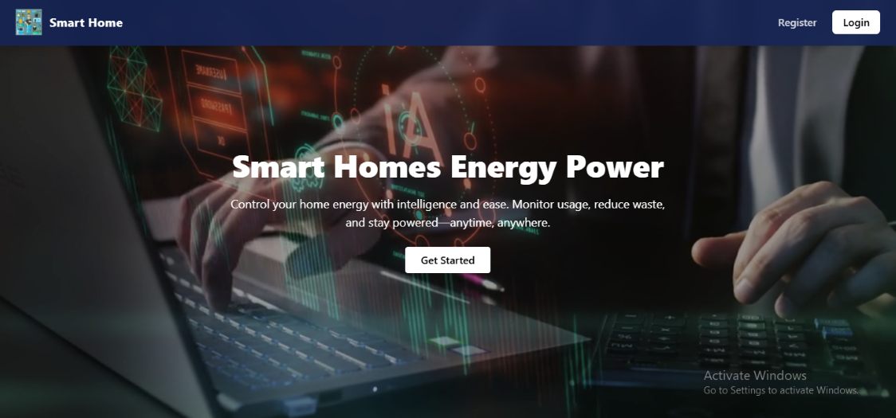

<p align="center">
  
</p>

<p align="center">
 


</p>

# ⚡ Smart Home Energy Monitoring System

> A modern web application that empowers homeowners to monitor, analyze, and optimize household energy consumption through real-time dashboards, intelligent insights, and responsive user experiences.
 
---
 # ✨ Core Features

### ⚡ Real-Time Energy Monitoring
Track household energy consumption through an interactive dashboard with real-time statistics and visual insights that help users understand their electricity usage.

### 📊 Interactive Analytics Dashboard
Visualize energy consumption using dynamic charts and responsive data visualizations, making complex information easy to interpret.

### 🔐 Secure User Authentication
Provides secure user registration, login, and account management using Firebase Authentication to protect user data.

### ⚠️ Energy Safety Monitoring
Monitor abnormal energy consumption patterns and help identify potential issues before they become costly or unsafe.

### 🛠 Maintenance Tracking
Manage maintenance schedules and monitor equipment status to improve system reliability and operational efficiency.

### ☁️ Cloud Data Synchronization
Utilizes Cloud Firestore to securely synchronize user and monitoring data, providing a seamless experience across sessions.

### 📱 Fully Responsive Interface
Designed to deliver a consistent and intuitive experience across desktop, tablet, and mobile devices.

### 🎨 Modern User Experience
Built with a clean, accessible, and user-friendly interface focused on usability, performance, and efficient navigation.

---
 # 🛠 Tech Stack

### Frontend

- React
- TypeScript
- Tailwind CSS
- React Router
- Recharts

### Backend & Cloud Services

- Firebase Authentication
- Cloud Firestore

### Development Tools

- Vite
- Git & GitHub
- Postman

---
 # 🏗 Architecture

```text
                 User
                   │
                   ▼
        React + TypeScript
                   │
        Reusable UI Components
                   │
      Firebase Authentication
                   │
          Cloud Firestore
                   │
      Energy Monitoring Dashboard
```

The Smart Home Energy Monitoring System follows a modular frontend architecture designed to deliver a scalable, maintainable, and responsive user experience.

The presentation layer is built with reusable React components and TypeScript, enabling clean separation of concerns and improved code maintainability. Firebase Authentication provides secure user access, while Cloud Firestore manages cloud-based application data and supports real-time synchronization.

The architecture was designed with future scalability in mind, allowing additional IoT devices, AI-powered analytics, predictive energy monitoring, and advanced reporting capabilities to be integrated with minimal architectural changes.

 ---

# 🚧 Technical Challenges

One of the primary engineering challenges during development was creating a responsive dashboard capable of presenting energy consumption data in a clear and intuitive way while maintaining smooth application performance.

Additional challenges included managing authenticated user sessions, organizing reusable React components, and ensuring that real-time data updates did not negatively impact the user experience.

These challenges were addressed through:

- Modular React component architecture
- Efficient state management
- Responsive UI design principles
- Reusable visualization components
- Firebase Authentication integration
- Optimized rendering of dashboard components

 ---

# 📈 Performance & User Experience

The application was designed with usability, responsiveness, and performance as core priorities. Every interface was developed to provide a smooth experience across desktop, tablet, and mobile devices while keeping navigation simple and intuitive.

Key improvements included:

- Faster dashboard rendering through reusable React components
- Responsive layouts optimized for multiple screen sizes
- Interactive data visualizations for improved readability
- Simplified navigation and user workflows
- Efficient cloud-based data synchronization with Firebase
- Clean, maintainable frontend architecture for future scalability
- Consistent user experience across the application

 ---

# 🎯 Project Impact

The Smart Home Energy Monitoring System demonstrates how modern web technologies can be combined to create an interactive platform for monitoring and managing household energy consumption.

Through this project, I explored practical approaches to building responsive dashboards, integrating cloud-based services, and presenting real-time information in a way that is both accessible and easy to understand.

The project highlights my ability to:

- Design responsive and user-friendly web interfaces
- Build scalable React applications with TypeScript
- Integrate Firebase Authentication and Cloud Firestore
- Develop reusable component-based architectures
- Visualize data using interactive charts and dashboards
- Deliver maintainable and performance-focused frontend applications


  ---

# 📚 What I Learned

Building the Smart Home Energy Monitoring System strengthened both my frontend engineering skills and my understanding of modern cloud-based application development.

Throughout the project, I gained practical experience in:

- Designing scalable React applications using reusable components
- Building responsive user interfaces with TypeScript
- Implementing secure authentication using Firebase Authentication
- Managing cloud-hosted data with Cloud Firestore
- Creating interactive data visualizations with Recharts
- Structuring projects for maintainability and future scalability
- Writing cleaner, more organized, and reusable code
- Improving debugging and problem-solving skills during development

This project also reinforced the importance of writing maintainable software, designing intuitive user experiences, and thinking beyond implementation toward long-term scalability.


 ---

# 🖼 Application Preview

<p align="center">
  
  
</p>

<p align="center">
  
  
</p>

The screenshots above highlight the application's responsive dashboard, interactive energy analytics, and mobile-friendly interface, demonstrating a consistent user experience across desktop and mobile devices.

---

# ⚙️ Installation

Clone the repository

```bash
git clone https://github.com/Sinsydev/smart-home-energy.git
```

Navigate into the project folder

```bash
cd smart-home-energy
```

Install dependencies

```bash
npm install
```

Run the development server

```bash
npm run dev
```

Open in your browser:

```
http://localhost:5173
```

---

 # 📂 Project Structure


 smart-home-energy
│
├── public/
│
├── screenshots/
│   ├── banner.png
│   ├── demo.gif
│   ├── home.png
│   ├── dashboard.png
│   ├── chart.png
│   └── maintenance.png
│
├── src/
│   ├── components/
│   │   ├── Sidebar.tsx
│   │   ├── Navbar.tsx
│   │   └── EnergyChart.tsx
│   │
│   ├── pages/
│   │   ├── Home.tsx
│   │   ├── Login.tsx
│   │   ├── Register.tsx
│   │   ├── Dashboard.tsx
│   │   ├── Maintenance.tsx
│   │   └── Status.tsx
│   │
│   ├── services/
│   │   └── firebaseConfig.ts
│   │
│   ├── App.tsx
│   └── main.tsx
│
├── package.json
├── tsconfig.json
├── README.md
└── .gitignore
```

---

# 🔮 Future Improvements

* IoT smart device integration
* AI-based energy consumption prediction
* Mobile application version
* Advanced analytics and reports
* Smart notification system

---

# 👨‍💻 Author

**Ismail Aminu Said**

GitHub
https://github.com/Sinsydev

LinkedIn
https://in/sinsy-dev

---

# ⭐ Support

If you find this project useful, consider giving it a **star ⭐ on GitHub**.

---

# 📜 License

This project is licensed under the **MIT License**.

